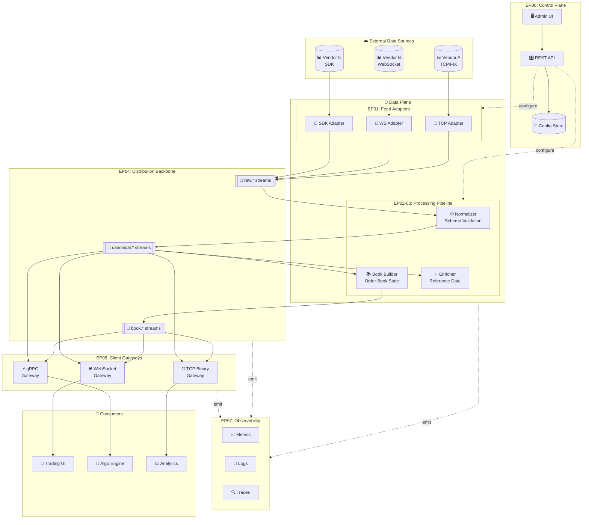
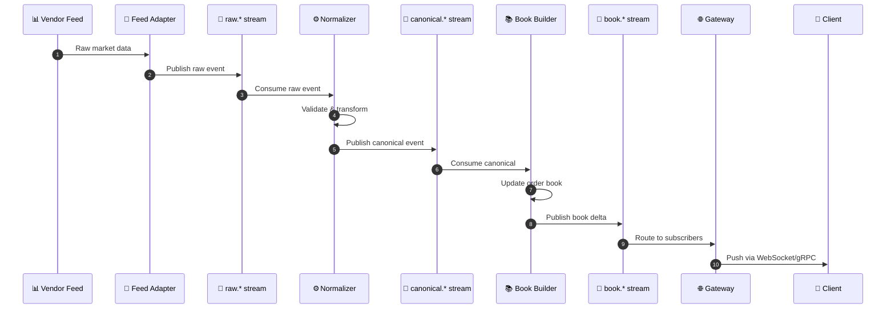
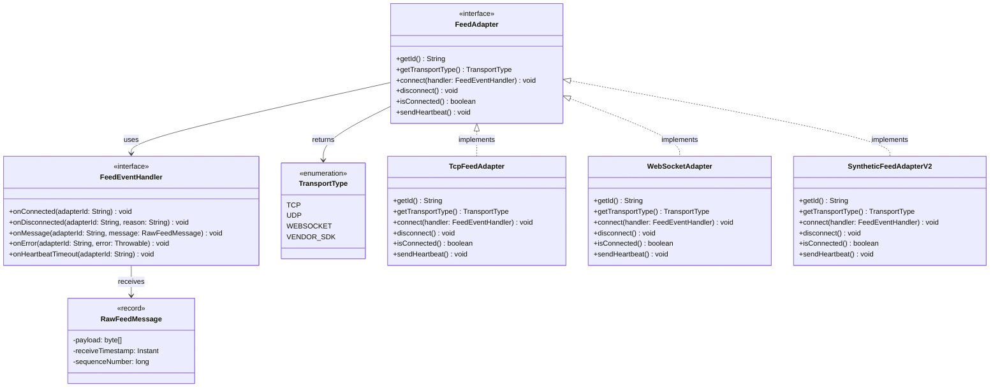
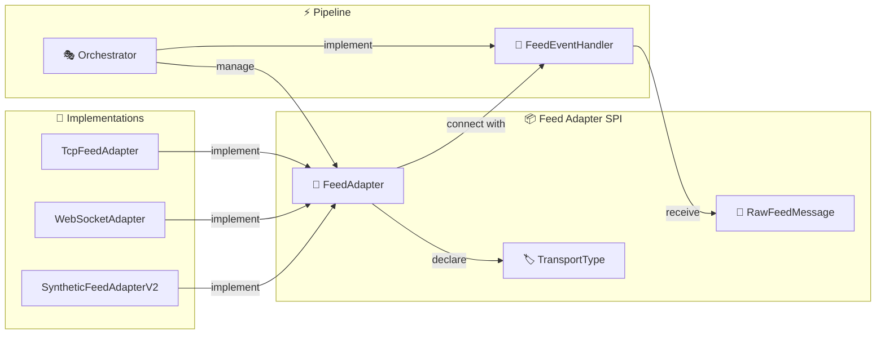
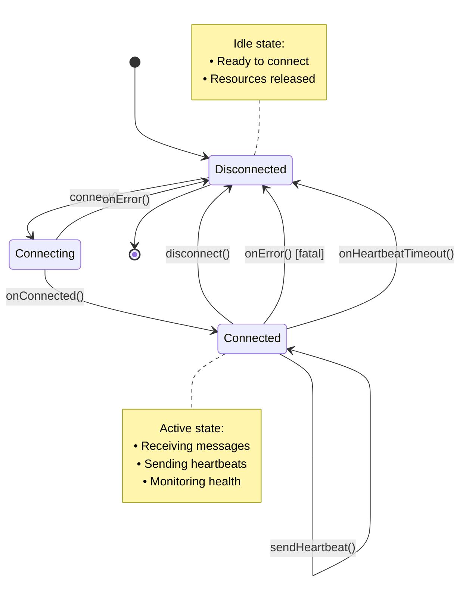
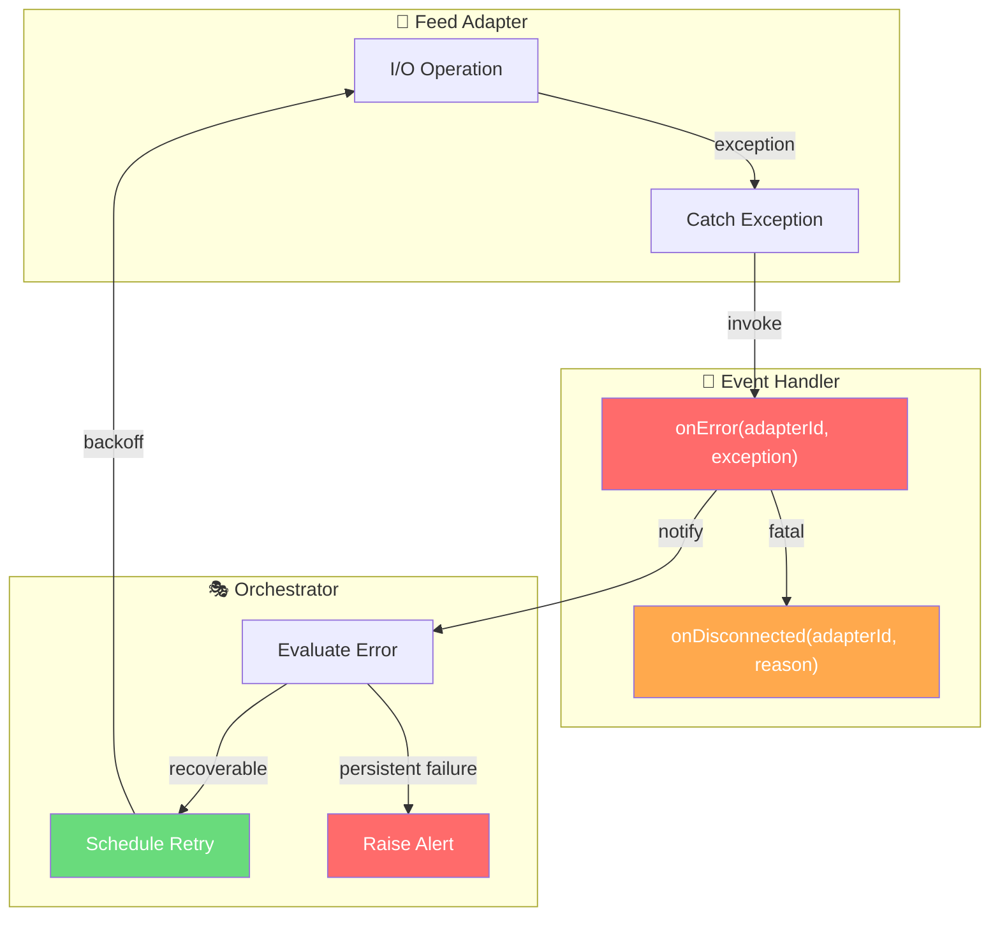
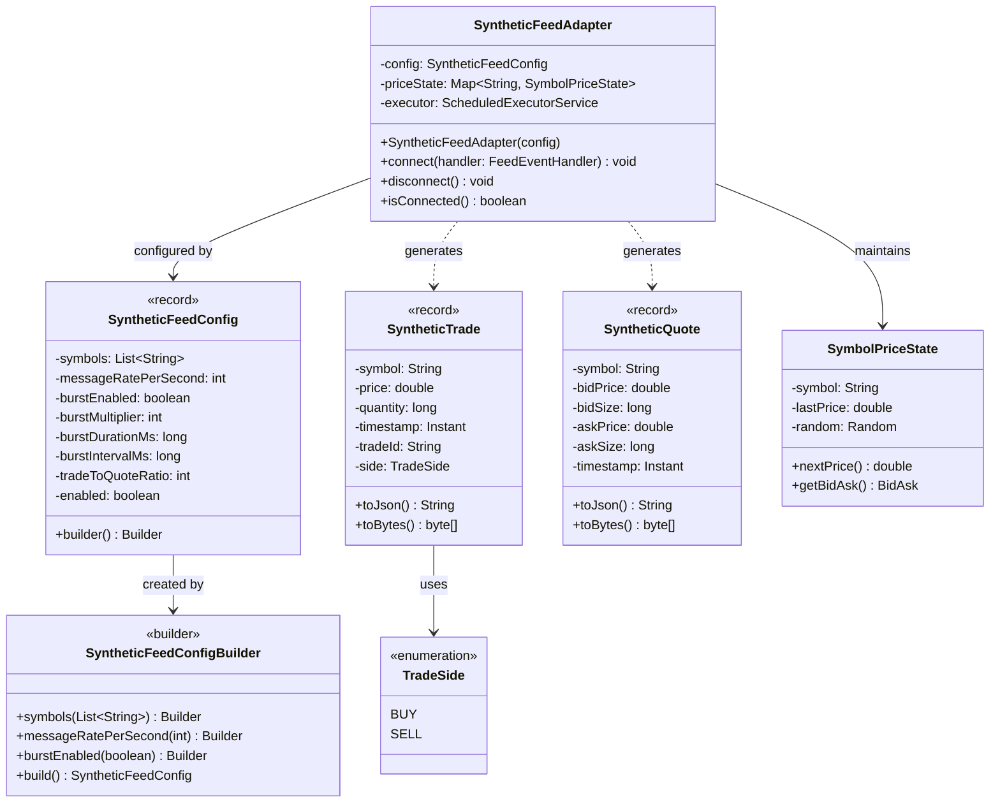
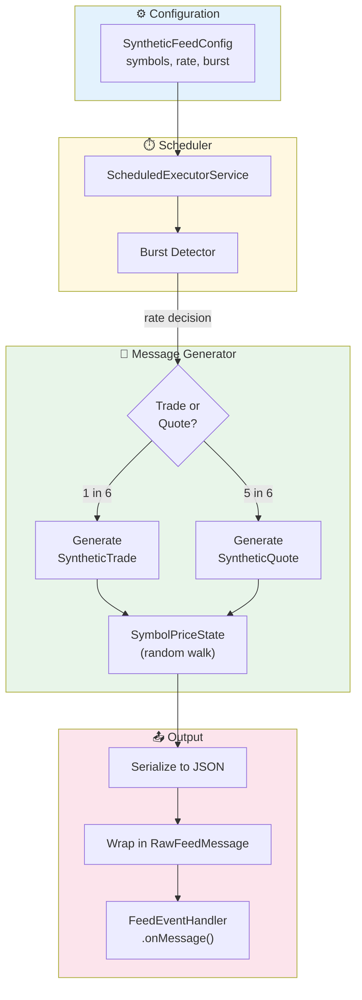
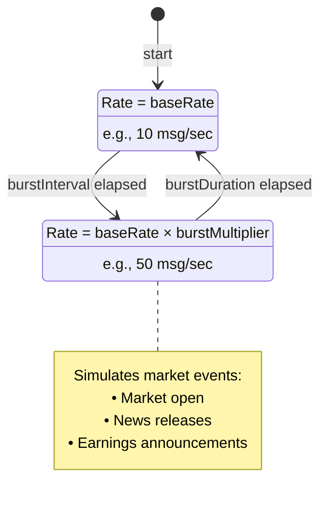

# PulseWire Architecture Overview

This document provides a high-level architecture for PulseWire based on the PRD and maps major components to implementation epics.

---

## 🏗️ System Architecture



---

## 📦 Logical Components

| Epic | Component | Description |
|:----:|-----------|-------------|
| 🟢 EP01 | **Feed Adapter Services** | Ingest market data from vendor feeds |
| 🟡 EP02 | **Normalizer Service** | Schema validation and canonical mapping |
| 🟠 EP03 | **Book Builder & Enrichment** | Order book state and reference data |
| 🔴 EP04 | **Distribution Backbone** | Kafka/in-memory event streaming |
| 🟣 EP05 | **Client Gateways** | WebSocket, gRPC, TCP binary APIs |
| 🔵 EP06 | **Control Plane & Admin UI** | Configuration and management |
| ⚪ EP07 | **Observability & SRE** | Metrics, logs, traces, alerting |
| 🟤 EP08 | **Security & Entitlements** | Auth, audit, access control |
| ⚫ EP09 | **Replay & Data Quality** | Historical replay and validation |

---

## 🌊 Event Flow



---

## 🚀 Deployment Considerations

| Aspect | Approach |
|--------|----------|
| **Containerization** | Docker containers on Kubernetes |
| **Scaling** | Horizontal scaling by partition |
| **Environments** | Local (in-memory) → Integration → Staging → Production |
| **Internal Security** | mTLS between services |
| **API Security** | OAuth2/JWT for control plane |
| **Monitoring** | Metrics & traces aligned with latency SLOs |

---

## 🔌 US01-01: Feed Adapter SPI Architecture

### 📋 Design Decisions

| ADR | Decision | Rationale |
|:---:|----------|-----------|
| **ADR-001** | **Callback-based SPI over polling** | Lower latency, natural async I/O fit, simpler backpressure |
| **ADR-002** | **Transport type as metadata** | Downstream stages remain transport-agnostic; metrics tagged by transport |
| **ADR-003** | **Separate lifecycle from events** | Cleaner separation of concerns; easier testing and composition |

---

### 📐 Class Diagram



---

### 🔗 Component Interaction



---

### ⚡ Lifecycle State Machine



---

### 🧵 Threading Model

```
┌─────────────────────────────────────────────────────────────────────────┐
│                         THREADING ARCHITECTURE                          │
├─────────────────────────────────────────────────────────────────────────┤
│                                                                         │
│   ┌─────────────┐      ┌─────────────┐      ┌─────────────┐            │
│   │  Adapter 1  │      │  Adapter 2  │      │  Adapter 3  │            │
│   │ ┌─────────┐ │      │ ┌─────────┐ │      │ ┌─────────┐ │            │
│   │ │ I/O     │ │      │ │ I/O     │ │      │ │ I/O     │ │            │
│   │ │ Thread  │ │      │ │ Thread  │ │      │ │ Thread  │ │            │
│   │ └────┬────┘ │      │ └────┬────┘ │      │ └────┬────┘ │            │
│   └──────┼──────┘      └──────┼──────┘      └──────┼──────┘            │
│          │                    │                    │                    │
│          ▼                    ▼                    ▼                    │
│   ┌─────────────────────────────────────────────────────────┐          │
│   │               FeedEventHandler Callbacks                 │          │
│   │  ┌──────────────┬──────────────┬──────────────────────┐ │          │
│   │  │ onConnected  │ onMessage    │ onError/Timeout      │ │          │
│   │  └──────────────┴──────────────┴──────────────────────┘ │          │
│   └─────────────────────────┬───────────────────────────────┘          │
│                             │                                           │
│                             ▼                                           │
│   ┌─────────────────────────────────────────────────────────┐          │
│   │              Downstream Processing Stage                 │          │
│   │           (handles thread handoff if needed)             │          │
│   └─────────────────────────────────────────────────────────┘          │
│                                                                         │
│   ⚠️  IMPORTANT: onMessage must be non-blocking!                       │
│       Offload heavy processing to separate thread pools.                │
│                                                                         │
└─────────────────────────────────────────────────────────────────────────┘
```

---

### 🚨 Error Handling Flow



---

## 🎲 US01-02: Synthetic Exchange Feed Adapter Architecture

### Design Decisions

| ADR | Decision | Rationale |
|:---:|----------|-----------|
| **ADR-004** | **Immutable configuration object** | Thread-safe sharing, no mid-flight changes during operation |
| **ADR-005** | **Builder pattern for configuration** | Clean API for many optional parameters with validation |
| **ADR-006** | **Separate Trade/Quote records** | Type safety, clear semantics, easy serialization |
| **ADR-007** | **JSON serialization for raw payload** | Human-readable for debugging, standard format |
| **ADR-008** | **Scheduler-based burst pattern** | Predictable timing, easy to test, non-blocking |

---

### 📐 Class Diagram



---

### 🔄 Message Generation Flow



---

### 📊 Burst Pattern State Machine



---

### 🔧 Configuration Schema

```yaml
synthetic:
  enabled: true                    # AC1: Start/stop via config
  symbols:                         # AC3: Symbol list
    - AAPL
    - GOOGL
    - MSFT
    - AMZN
  messageRatePerSecond: 10         # AC3: Message rate
  burst:                           # AC3: Burst patterns
    enabled: true
    multiplier: 5
    durationMs: 1000
    intervalMs: 10000
  tradeToQuoteRatio: 5             # 1 trade per 5 quotes
```

