# PulseWire Architecture Overview

This document provides a high-level architecture for PulseWire based on the PRD and maps major components to implementation epics.

---

## 🏗️ System Architecture

```mermaid
flowchart TB
    subgraph External["☁️ External Data Sources"]
        V1[("📊 Vendor A<br/>TCP/FIX")]
        V2[("📊 Vendor B<br/>WebSocket")]
        V3[("📊 Vendor C<br/>SDK")]
    end

    subgraph DataPlane["🔄 Data Plane"]
        subgraph Adapters["EP01: Feed Adapters"]
            FA1["🔌 TCP Adapter"]
            FA2["🔌 WS Adapter"]
            FA3["🔌 SDK Adapter"]
        end
        
        subgraph Processing["EP02-03: Processing Pipeline"]
            NORM["⚙️ Normalizer<br/>Schema Validation"]
            BOOK["📚 Book Builder<br/>Order Book State"]
            ENRICH["✨ Enricher<br/>Reference Data"]
        end
    end

    subgraph Backbone["EP04: Distribution Backbone"]
        RAW[["📨 raw.* streams"]]
        CANON[["📨 canonical.* streams"]]
        BOOKS[["📨 book.* streams"]]
    end

    subgraph Gateways["EP05: Client Gateways"]
        GW1["🌐 WebSocket<br/>Gateway"]
        GW2["⚡ gRPC<br/>Gateway"]
        GW3["🔗 TCP Binary<br/>Gateway"]
    end

    subgraph ControlPlane["EP06: Control Plane"]
        API["🎛️ REST API"]
        UI["🖥️ Admin UI"]
        CFG[("💾 Config Store")]
    end

    subgraph Observability["EP07: Observability"]
        MET["📈 Metrics"]
        LOG["📝 Logs"]
        TRC["🔍 Traces"]
    end

    subgraph Clients["👥 Consumers"]
        C1["📱 Trading UI"]
        C2["🤖 Algo Engine"]
        C3["📊 Analytics"]
    end

    V1 --> FA1
    V2 --> FA2
    V3 --> FA3
    
    FA1 & FA2 & FA3 --> RAW
    RAW --> NORM
    NORM --> CANON
    CANON --> BOOK
    BOOK --> BOOKS
    CANON --> ENRICH
    
    BOOKS --> GW1 & GW2 & GW3
    CANON --> GW1 & GW2 & GW3
    
    GW1 --> C1
    GW2 --> C2
    GW3 --> C3
    
    API --> CFG
    UI --> API
    API -.->|configure| Adapters
    API -.->|configure| Processing
    
    DataPlane -.->|emit| Observability
    Backbone -.->|emit| Observability
    Gateways -.->|emit| Observability
```



---

## 📦 Logical Components

| Epic | Component | Description |
|:----:|-----------|-------------|
| 🟢 EP01 | **Feed Adapter Services** | Ingest market data from vendor feeds |
| 🟡 EP02 | **Normalizer Service** | Schema validation and canonical mapping |
| 🟠 EP03 | **Book Builder & Enrichment** | Order book state and reference data |
| 🔴 EP04 | **Distribution Backbone** | Kafka/in-memory event streaming |
| 🟣 EP05 | **Client Gateways** | WebSocket, gRPC, TCP binary APIs |
| 🔵 EP06 | **Control Plane & Admin UI** | Configuration and management |
| ⚪ EP07 | **Observability & SRE** | Metrics, logs, traces, alerting |
| 🟤 EP08 | **Security & Entitlements** | Auth, audit, access control |
| ⚫ EP09 | **Replay & Data Quality** | Historical replay and validation |

---

## 🌊 Event Flow

```mermaid
sequenceDiagram
    autonumber
    participant V as 📊 Vendor Feed
    participant A as 🔌 Feed Adapter
    participant R as 📨 raw.* stream
    participant N as ⚙️ Normalizer
    participant C as 📨 canonical.* stream
    participant B as 📚 Book Builder
    participant K as 📨 book.* stream
    participant G as 🌐 Gateway
    participant U as 👤 Client

    V->>A: Raw market data
    A->>R: Publish raw event
    R->>N: Consume raw event
    N->>N: Validate & transform
    N->>C: Publish canonical event
    C->>B: Consume canonical
    B->>B: Update order book
    B->>K: Publish book delta
    K->>G: Route to subscribers
    G->>U: Push via WebSocket/gRPC
```



---

## 🚀 Deployment Considerations

| Aspect | Approach |
|--------|----------|
| **Containerization** | Docker containers on Kubernetes |
| **Scaling** | Horizontal scaling by partition |
| **Environments** | Local (in-memory) → Integration → Staging → Production |
| **Internal Security** | mTLS between services |
| **API Security** | OAuth2/JWT for control plane |
| **Monitoring** | Metrics & traces aligned with latency SLOs |

---

## 🔌 US01-01: Feed Adapter SPI Architecture

### 📋 Design Decisions

| ADR | Decision | Rationale |
|:---:|----------|-----------|
| **ADR-001** | **Callback-based SPI over polling** | Lower latency, natural async I/O fit, simpler backpressure |
| **ADR-002** | **Transport type as metadata** | Downstream stages remain transport-agnostic; metrics tagged by transport |
| **ADR-003** | **Separate lifecycle from events** | Cleaner separation of concerns; easier testing and composition |

---

### 📐 Class Diagram


---

### 🔗 Component Interaction

```mermaid
flowchart LR
    subgraph SPI["📦 Feed Adapter SPI"]
        direction TB
        FA["🔌 FeedAdapter"]
        TT["🏷️ TransportType"]
        RM["📧 RawFeedMessage"]
    end

    subgraph Implementations["🔧 Implementations"]
        direction TB
        TCP["TcpFeedAdapter"]
        WS["WebSocketAdapter"]
        SYN["SyntheticFeedAdapterV2"]
    end

    subgraph Pipeline["⚡ Pipeline"]
        direction TB
        FEH["📡 FeedEventHandler"]
        ORK["🎭 Orchestrator"]
    end

    TCP & WS & SYN -->|implement| FA
    FA -->|declare| TT
    FA -->|connect with| FEH
    FEH -->|receive| RM
    ORK -->|manage| FA
    ORK -->|implement| FEH
```



---

### ⚡ Lifecycle State Machine

```mermaid
stateDiagram-v2
    [*] --> Disconnected
    
    Disconnected --> Connecting : connect()
    Connecting --> Connected : onConnected()
    Connecting --> Disconnected : onError()
    
    Connected --> Connected : onMessage()
    Connected --> Connected : sendHeartbeat()
    Connected --> Disconnected : disconnect()
    Connected --> Disconnected : onError() [fatal]
    Connected --> Disconnected : onHeartbeatTimeout()
    
    Disconnected --> [*]
    
    note right of Connected
        Active state:
        • Receiving messages
        • Sending heartbeats
        • Monitoring health
    end note
    
    note left of Disconnected
        Idle state:
        • Ready to connect
        • Resources released
    end note
```



---

### 🧵 Threading Model

```
┌─────────────────────────────────────────────────────────────────────────┐
│                         THREADING ARCHITECTURE                          │
├─────────────────────────────────────────────────────────────────────────┤
│                                                                         │
│   ┌─────────────┐      ┌─────────────┐      ┌─────────────┐            │
│   │  Adapter 1  │      │  Adapter 2  │      │  Adapter 3  │            │
│   │ ┌─────────┐ │      │ ┌─────────┐ │      │ ┌─────────┐ │            │
│   │ │ I/O     │ │      │ │ I/O     │ │      │ │ I/O     │ │            │
│   │ │ Thread  │ │      │ │ Thread  │ │      │ │ Thread  │ │            │
│   │ └────┬────┘ │      │ └────┬────┘ │      │ └────┬────┘ │            │
│   └──────┼──────┘      └──────┼──────┘      └──────┼──────┘            │
│          │                    │                    │                    │
│          ▼                    ▼                    ▼                    │
│   ┌─────────────────────────────────────────────────────────┐          │
│   │               FeedEventHandler Callbacks                 │          │
│   │  ┌──────────────┬──────────────┬──────────────────────┐ │          │
│   │  │ onConnected  │ onMessage    │ onError/Timeout      │ │          │
│   │  └──────────────┴──────────────┴──────────────────────┘ │          │
│   └─────────────────────────┬───────────────────────────────┘          │
│                             │                                           │
│                             ▼                                           │
│   ┌─────────────────────────────────────────────────────────┐          │
│   │              Downstream Processing Stage                 │          │
│   │           (handles thread handoff if needed)             │          │
│   └─────────────────────────────────────────────────────────┘          │
│                                                                         │
│   ⚠️  IMPORTANT: onMessage must be non-blocking!                       │
│       Offload heavy processing to separate thread pools.                │
│                                                                         │
└─────────────────────────────────────────────────────────────────────────┘
```

---

### 🚨 Error Handling Flow


