# 🎓 PulseWire: The Simple Guide

> **ELI5** = "Explain Like I'm 5"  
> This document explains everything in PulseWire in the simplest possible terms.

---

## 🎯 What is PulseWire?

### The One-Sentence Answer

**PulseWire is a super-fast post office for stock market data.**

### The Longer Story

Imagine you want to know the price of Apple stock. That information comes from stock exchanges like NYSE. But here's the problem:

#### ❌ The Problem: Too Many Languages!

```mermaid
flowchart LR
    subgraph Exchanges["📊 Stock Exchanges"]
        NYSE["🏛️ NYSE<br/>Format A"]
        NASDAQ["🏛️ NASDAQ<br/>Format B"]
        London["🏛️ London<br/>Format C"]
        Tokyo["🏛️ Tokyo<br/>Format D"]
    end
    
    subgraph Problem["😵 Your App"]
        App["📱 Only speaks<br/>ONE format!"]
    end
    
    NYSE -.->|"❓"| App
    NASDAQ -.->|"❓"| App
    London -.->|"❓"| App
    Tokyo -.->|"❓"| App
    
    style App fill:#ffcccc,stroke:#ff0000
    style Problem fill:#fff5f5
```



#### ✅ The Solution: PulseWire Translates Everything!


---

## 🏗️ Project Layout

```mermaid
flowchart TB
    subgraph Project["📂 PulseWire Project"]
        direction TB
        Core["🧰 <b>pulsewire-core</b><br/><i>The Toolbox</i>"]
        Control["🎛️ <b>pulsewire-control-plane</b><br/><i>Manager's Office</i>"]
        Data["📬 <b>pulsewire-data-plane</b><br/><i>Mail Sorting Room</i>"]
        Frontend["🖥️ <b>pulsewire-frontend</b><br/><i>Customer Window</i>"]
        Docs["📚 <b>docs</b><br/><i>You are here!</i>"]
    end
    
    style Core fill:#fff3cd
    style Control fill:#cce5ff
    style Data fill:#d4edda
    style Frontend fill:#f8d7da
    style Docs fill:#e2e3e5
```



| Module | Real-World Analogy | What It Does |
|:------:|-------------------|--------------|
| 🧰 **core** | Toolbox | Shared code everyone uses |
| 🎛️ **control-plane** | Manager's office | Configure feeds, users, settings |
| 📬 **data-plane** | Mail sorting room | Receives, translates, delivers data |
| 🖥️ **frontend** | Customer window | Web interface to see everything |

---

## 📚 What We've Built (Implementation Log)

This section grows as we implement more features. Each entry explains what we built and why.

---

### ✅ US01-01: Feed Adapter SPI (Plugin System)

**📅 Implemented:** February 2026  
**📁 Location:** `pulsewire-data-plane/src/main/java/com/pulsewire/dataplane/adapter/spi/`

#### What Did We Build?

We built a **plugin system** for connecting to different stock exchanges.

#### Why Do We Need This?

Different stock exchanges send data differently:
- NYSE might use a phone-call-style connection (TCP)
- A crypto exchange might use a chat-app-style connection (WebSocket)
- Bloomberg might require special software (Vendor SDK)

Instead of writing separate code for each, we created a **standard interface** that all connections must follow.

#### The Parts We Created

| File | What It Is | Simple Explanation |
|------|-----------|-------------------|
| `TransportType.java` | A list of connection types | Like choosing: phone call, text message, or fax |
| `RawFeedMessage.java` | A message envelope | Contains: the data + when it arrived + message number |
| `FeedEventHandler.java` | Notification callbacks | How the adapter says "I connected!" or "New data!" or "Error!" |
| `FeedAdapter.java` | The job description | Rules every adapter must follow |
| `SyntheticFeedAdapterV2.java` | A practice adapter | Generates fake data for testing |

#### How It Works (The Flow)



```mermaid
flowchart TB
    subgraph Step1["<b>Step 1: CREATE</b> 🏗️"]
        Create["adapter = new NyseAdapter()"]
    end
    
    subgraph Step2["<b>Step 2: CONNECT</b> 🔌"]
        Connect["adapter.connect(myHandler)<br/><br/><i>'Connect to NYSE and tell myHandler<br/>whenever something happens'</i>"]
    end
    
    subgraph Step3["<b>Step 3: EVENTS FLOW</b> 📨"]
        Events["📗 onConnected('NYSE')<br/>📬 onMessage('NYSE', data1)<br/>📬 onMessage('NYSE', data2)<br/>📬 onMessage('NYSE', data3)<br/><i>...hundreds per second...</i>"]
    end
    
    subgraph Step4["<b>Step 4: DISCONNECT</b> 🔴"]
        Disconnect["adapter.disconnect()<br/><br/>📕 onDisconnected('NYSE')"]
    end
    
    Step1 --> Step2
    Step2 --> Step3
    Step3 --> Step4
    
    style Step1 fill:#e3f2fd
    style Step2 fill:#e8f5e9
    style Step3 fill:#fff8e1
    style Step4 fill:#ffebee
```

#### Adapter Lifecycle State Machine

```mermaid
stateDiagram-v2
    [*] --> Disconnected: Created
    
    Disconnected --> Connecting: connect()
    Connecting --> Connected: ✅ onConnected
    Connecting --> Disconnected: ❌ onError
    
    Connected --> Connected: 📬 onMessage
    Connected --> Connected: 💓 sendHeartbeat
    Connected --> Disconnected: disconnect()
    Connected --> Disconnected: ❌ onError (fatal)
    Connected --> Disconnected: ⏰ onHeartbeatTimeout
    
    Disconnected --> [*]: Done
    
    note right of Connected
        🟢 Active State
        • Receiving messages
        • Sending heartbeats
        • Monitoring health
    end note
    
    note left of Disconnected
        ⚪ Idle State
        • Ready to connect
        • Resources released
    end note
```



#### Why "SPI" (Service Provider Interface)?

It's a fancy Java term for "plugin system":

```mermaid
flowchart LR
    subgraph Bad["❌ <b>Without SPI</b>"]
        direction TB
        BadCore["PulseWire knows about<br/>NYSE, NASDAQ, Bloomberg..."]
        BadAdd["To add Tokyo:<br/>😰 Edit core code<br/>😰 Rebuild everything<br/>😰 Risk breaking things"]
    end
    
    subgraph Good["✅ <b>With SPI</b>"]
        direction TB
        GoodCore["PulseWire only knows<br/>THE RULES (interface)"]
        GoodAdd["To add Tokyo:<br/>🎉 Just add a JAR file!<br/>🎉 Zero changes to core<br/>🎉 Java finds it auto-magic"]
    end
    
    style Bad fill:#ffebee,stroke:#c62828
    style Good fill:#e8f5e9,stroke:#2e7d32
    style BadCore fill:#ffcdd2
    style BadAdd fill:#ffcdd2
    style GoodCore fill:#c8e6c9
    style GoodAdd fill:#c8e6c9
```



#### How Plugins Are Discovered

```mermaid
flowchart TB
    subgraph Discovery["🔍 Java ServiceLoader Magic"]
        direction LR
        File["📄 META-INF/services/<br/>FeedAdapter"]
        Loader["⚙️ ServiceLoader"]
        Plugins["🔌 All Adapters"]
    end
    
    subgraph Adapters["📦 Available Plugins"]
        TCP["TcpAdapter"]
        WS["WebSocketAdapter"]
        Synth["SyntheticAdapter"]
    end
    
    File -->|"lists classes"| Loader
    Loader -->|"instantiates"| Plugins
    Plugins --> TCP
    Plugins --> WS
    Plugins --> Synth
    
    style Discovery fill:#e3f2fd
    style File fill:#bbdefb
    style Loader fill:#90caf9
```



#### Key Concepts

| Concept | Simple Explanation |
|:-------:|-------------------|
| 📋 **Interface** | A job description. "You MUST have these abilities." |
| 🔧 **Implementation** | Someone who can do the job. |
| 📞 **Callback** | "Call me back when something happens" |
| 💓 **Heartbeat** | "Are you still there?" ping to detect dead connections |

---

<!-- 
=======================================================================
  📝 TEMPLATE FOR FUTURE IMPLEMENTATIONS
  Copy this section when adding a new user story
=======================================================================

### ✅ US##-##: [Title]

**📅 Implemented:** [Date]  
**📁 Location:** `path/to/code/`

#### What Did We Build?

[One sentence summary]

#### Why Do We Need This?

[Explain the problem it solves in simple terms]

#### The Parts We Created

| File | What It Is | Simple Explanation |
|------|-----------|-------------------|
| `file1.java` | Description | Simple explanation |

#### How It Works (The Flow)

```mermaid
[Mermaid diagram showing the flow]
```

#### Key Concepts

| Concept | Simple Explanation |
|---------|-------------------|
| **Term1** | Explanation |

---
-->

---

## 🗺️ What's Coming Next

```mermaid
flowchart LR
    subgraph Done["✅ Completed"]
        EP01a["🔌 Feed Adapter SPI"]
    end
    
    subgraph InProgress["🔄 Up Next"]
        EP01b["📡 More Adapters"]
        EP02["⚙️ Normalizer"]
    end
    
    subgraph Future["⬜ Future"]
        EP03["📚 Book Builder"]
        EP04["🚀 Kafka Backbone"]
        EP05["🌐 Gateways"]
        EP06["🎛️ Control Plane"]
        EP07["📊 Monitoring"]
        EP08["🔒 Security"]
        EP09["🔁 Replay"]
    end
    
    Done --> InProgress --> Future
    
    style Done fill:#c8e6c9,stroke:#2e7d32
    style InProgress fill:#fff9c4,stroke:#f9a825
    style Future fill:#e3f2fd,stroke:#1976d2
```



| Epic | Feature | Status | Description |
|:----:|---------|:------:|-------------|
| EP01 | 🔌 Feed Adapters | 🟡 Partial | Connect to exchanges |
| EP02 | ⚙️ Normalizer | ⬜ Not started | Translate formats |
| EP03 | 📚 Book Builder | ⬜ Not started | Order book state |
| EP04 | 🚀 Message Backbone | ⬜ Not started | Kafka event streaming |
| EP05 | 🌐 Gateways | ⬜ Not started | WebSocket/gRPC/TCP APIs |
| EP06 | 🎛️ Control Plane | ⬜ Not started | Management APIs |
| EP07 | 📊 Monitoring | ⬜ Not started | Metrics & Alerting |
| EP08 | 🔒 Security | ⬜ Not started | Auth & Audit |
| EP09 | 🔁 Replay | ⬜ Not started | Data Quality |

---

## 🔤 Glossary (Dictionary of Terms)

```mermaid
mindmap
  root((📖 PulseWire<br/>Vocabulary))
    Data Flow
      🔌 Adapter
      📨 Feed
      📬 Message
      🚀 Backbone
    Architecture
      🎛️ Control Plane
      📬 Data Plane
      🌐 Gateway
    Connections
      💓 Heartbeat
      🔄 Transport
      📞 Callback
    Data Structures
      📚 Order Book
      ⚙️ Normalizer
      🔌 SPI
```



| Term | Icon | Simple Meaning |
|------|:----:|---------------|
| **Adapter** | 🔌 | A translator that connects to one data source |
| **Backbone** | 🚀 | The central highway for all messages (Kafka) |
| **Callback** | 📞 | "Hey, call this function when X happens" |
| **Control Plane** | 🎛️ | The management/admin side |
| **Data Plane** | 📬 | The actual data flow side |
| **Feed** | 📨 | A stream of market data from an exchange |
| **Gateway** | 🌐 | The door where apps connect to get data |
| **Heartbeat** | 💓 | A "ping" to check if connection is alive |
| **Normalizer** | ⚙️ | Translates different formats into one standard format |
| **Order Book** | 📚 | List of all buy/sell orders for a stock |
| **SPI** | 🔌 | Service Provider Interface = plugin system |
| **Transport** | 🔄 | HOW data is sent (TCP, WebSocket, etc.) |

---

## ❓ FAQ

**Q: Why not just one big program?**  
A: Because different parts need to scale differently. If we get 10x more data, we can add more adapters without touching the web UI.

**Q: Why Java?**  
A: Java is fast, mature, and widely used in finance. It handles multi-threading well, which is critical for low-latency trading.

**Q: What's the difference between control-plane and data-plane?**  
A: Control-plane = slow, rare changes (config, users). Data-plane = fast, constant flow (market data).

**Q: Why do we need tests?**  
A: Financial systems can't have bugs. A mistake could mean millions lost. Tests prove the code works before it goes live.

---

*This document is updated automatically as we implement new features. Last updated: February 2026*
